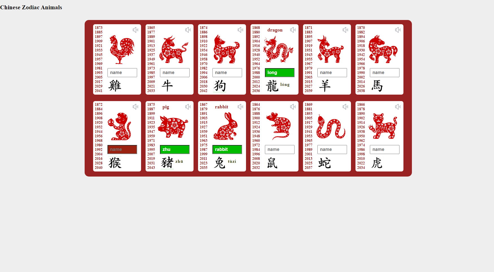

# chineseZodiac

## General Info
This project is made as an exercise to append sound, pictures and inputs for the animals in Chinese Zodiac.
Users can 'guess' the Chinese pinyin or english name of the animals.
Users can click the sound icon for the Chinese pronounciation of each character.
## Technologies
Project is created with Javascript.

## Deployment
Go to [https://jchen2190.github.io/chineseZodiacs/](https://jchen2190.github.io/chineseZodiacs/)